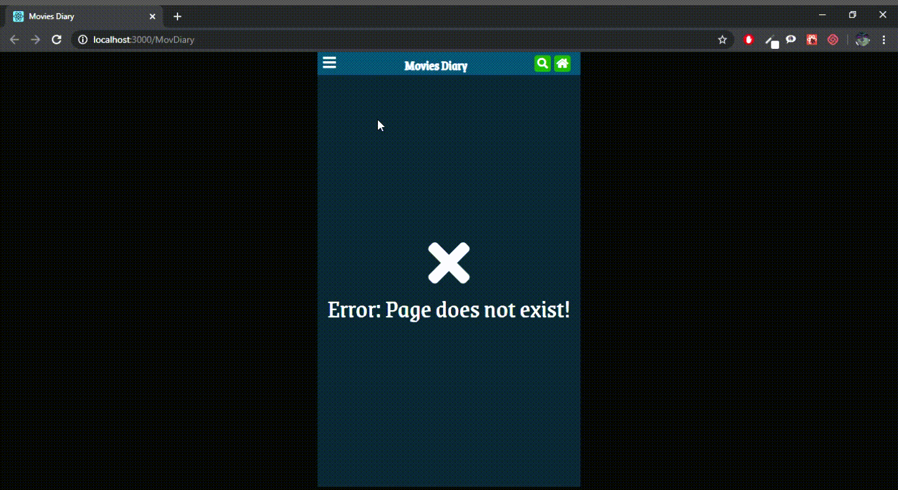

# Simple Screencast (Demo)


# Author
- Jesus Caraballo

# Requirements
- ReactJS
- NodeJS (https://nodejs.org/)
- Create React App (https://reactjs.org/docs/create-a-new-react-app.html#create-react-app)


# Simple Development Guide
## Before to start
- You must have installed NodeJS and Github in your machine.
- You must locate the folder where you want the repository.
```sh
  # Clone
  $ git clone https://github.com/jesucluna/MovDiary
  $ cd MovDiary
  # Create React App
  $ npm install
```

## ReactJs instructions
### 1. Run
```sh
  $ npm start
```   

# Simple Change log
All notable changes to this project will be documented in this file. The format is based on [Keep a Changelog](https://keepachangelog.com/)

#### [x.y.z] - AAAA-MM-DD
- **x** for major release related to major additions or changes.
- **y** **y** for minor release related to minor additions or changes in current major release.
-  **z** for minor release related to minor additions or changes in current minor release.

#### Types of changes
- **Added** for new features.
- **Changed** for changes in existing functionality.
- **Deprecated** for soon-to-be removed features.
- **Removed** for now removed features.
- **Fixed** for any bug fixes.
- **Security** in case of vulnerabilities.

## [2.1.0] - 2020-06-11
### Added
- `Search` component.
- `Screencast` in order to take a view of general views.

### Changed
- `Add` page to simulate last Optional view from search a movie (this is only static template).

## [2.0.0] - 2020-06-11
### Added
- `pages` folder inside `components` for make different views.
- `BrowserRouter` integred for move trhough pages (views).
- `Home` and `PopUp Modal` components in order to simulate Main Views.
- `Menu` component in order to simulate one of the Optional Views.
- `Menu bar` static for navigate trhough pages. 
- Simple and initial edition for other pages inside app.

### Removed
- `PopUp` component.

## [1.0.1] - 2020-06-09
### Added
- `views` folder where you can see templates for views to do with ReactJS.

## [1.0.0] - 2020-06-09
### Added

- Initial App  with ReactJs.
- `Modal` component for Popup card.
- Simple app in order to improve views
- Detailed `README`.
- Common `.gitignore` file.
